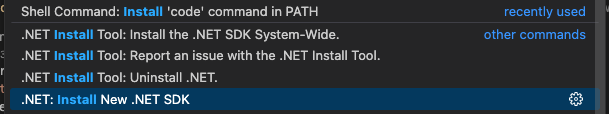
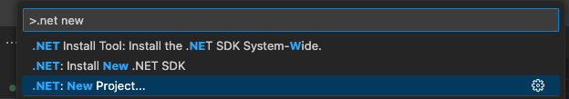
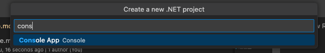
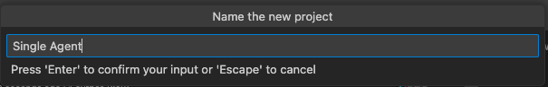

1. Get access to NPE Tenant
1. Install Docker and WSL https://docs.docker.com/desktop/setup/install/windows-install/
2. install aspire dashboard https://learn.microsoft.com/en-us/dotnet/aspire/fundamentals/dashboard/standalone?tabs=bash
2. Install redis - docker pull redis
3. run redis docker run -d --name redis-stack -p 6379:6379 -p 8001:8001 redis/redis-stack:latest
1. Install .net

1. Create new .net project 

2. Select Console Project

3. Name Project 
4. cd SingleAgent
4. dotnet add package Microsoft.SemanticKernel
5. dotnet add package Azure.Identity
5. dotnet add package Microsoft.SemanticKernel.Connectors.AzureOpenAI
5. dotnet add package Microsoft.SemanticKernel.Agents.Core --prerelease
5. dotnet add package Azure.AI.Projects --prerelease
5. dotnet add package OpenTelemetry.Exporter.Console
6. dotnet add package OpenTelemetry.Exporter.OpenTelemetryProtocol
7. dotnet add package StackExchange.Redis 
7. dotnet add package Microsoft.SemanticKernel.Connectors.Redis --prerelease
5. Add editorconfig
6. az login

dotnet add package Microsoft.SemanticKernel,Azure.Identity,Microsoft.SemanticKernel.Connectors.AzureOpenAI,OpenTelemetry.Exporter.Console,StackExchange.Redis 

dotnet add package Microsoft.SemanticKernel.Agents.Core,Microsoft.SemanticKernel.Connectors.Redis --prerelease